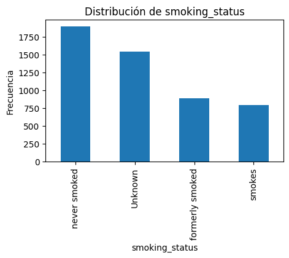
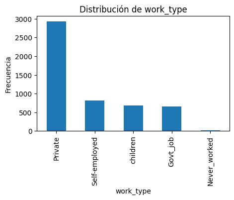
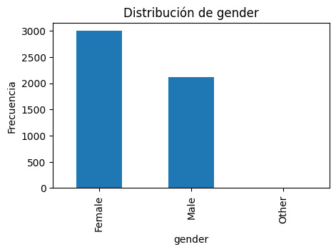
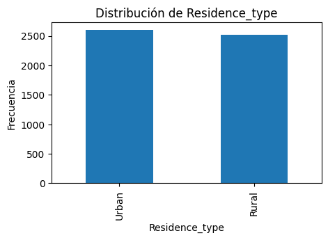
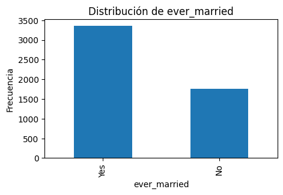
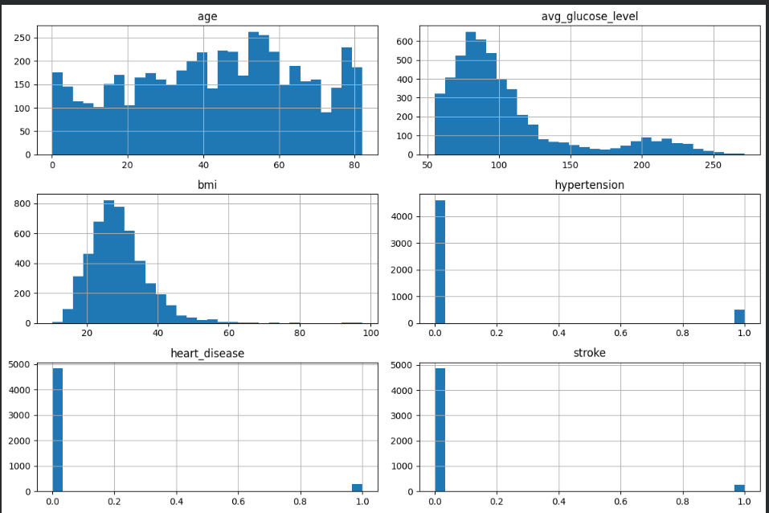
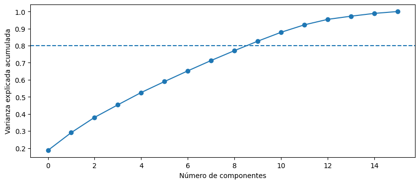
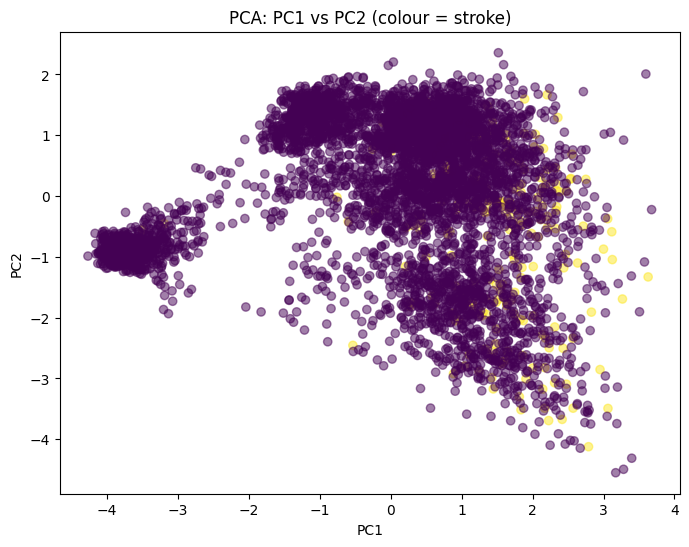

# Data Capture and Preparation Pipeline

This project presents an end-to-end data capture and preparation workflow in Python,
focusing on data quality, cleaning, transformation, and feature engineering for
downstream analytical tasks.

The objective is to showcase a real-world data preparation process rather than an
academic exercise, covering the typical steps required before applying statistical
or machine learning models.

---

## Project Overview

The workflow includes:

- Data loading and initial inspection
- Descriptive and exploratory data analysis (EDA)
- Detection and treatment of missing values
- Handling of categorical and numerical variables
- Feature engineering and transformations
- Feature scaling and standardisation
- Dimensionality reduction using PCA
- Feature selection using filter and wrapper methods

---

## Exploratory Data Analysis

The following visualisations illustrate the distribution of key variables and
highlight important characteristics such as class imbalance, skewness, and the
presence of outliers:

---

## Dimensionality Reduction (PCA)

Principal Component Analysis (PCA) was applied after feature encoding and
standardisation to analyse the intrinsic structure of the data and reduce
dimensionality.

The cumulative explained variance shows that a reduced number of components captures
a high proportion of the total variance:

The projection onto the first two principal components illustrates the data structure
and overlap between classes:

---

## Notes on Data Availability

The dataset used in this project is not included in the repository due to licensing
and distribution constraints.

To run the notebook locally:
1. Place the dataset file in your working directory.
2. Update the file path in the notebook accordingly.

---

## Technologies Used

- Python
- pandas
- numpy
- matplotlib
- scikit-learn

---

## Author

**Bencomo Vega**  
Data Analyst | Data Science Engineering student  
[LinkedIn](https://www.linkedin.com/)
